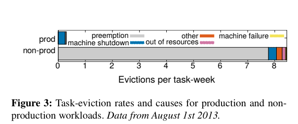
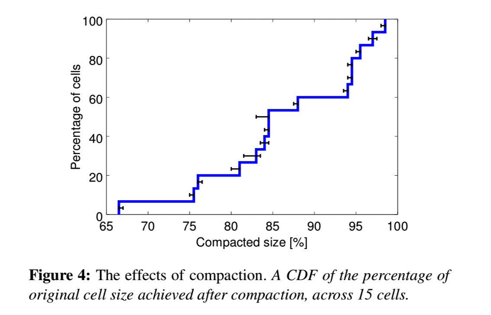
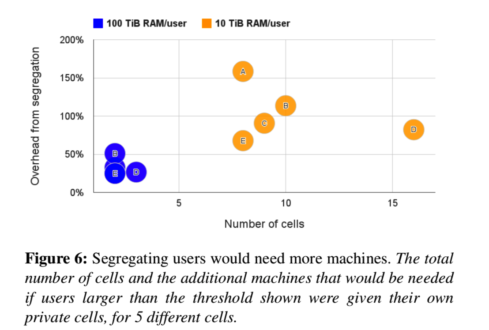
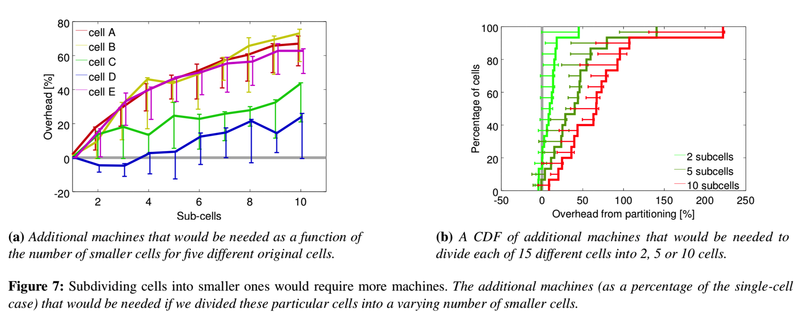
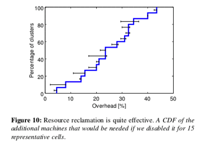
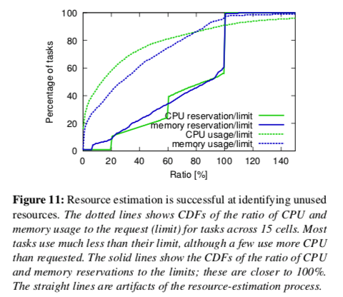
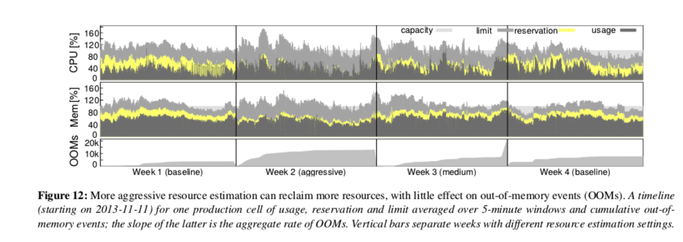
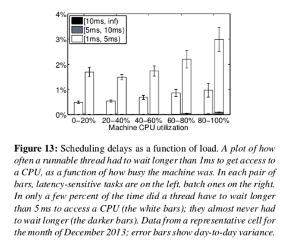

# Google 大规模集群管理器 Borg

* 原文地址：[Large-scale cluster management at Google with Borg](https://static.googleusercontent.com/media/research.google.com/zh-CN//pubs/archive/43438.pdf)

## Abstract

Google Borg 系统是一个集群管理器，运行着数千个应用程序的数以十万计的作业，跨多个由数万台机器组成的集群。

Borg 通过超配、进程级别资源隔离等，实现高效的资源利用率。支持应用高可用，最大限度的减少故障时间，并且可以通过调度策略降低相关故障发生的可能性。Borg 还提供了声明性工作规范语言，名称服务集成，实时作业监控以及分析和模拟系统行为的工具，简化用户操作。

## 1. Introduction

集群管理系统的内部代号是 Borg，它全程管理、调度、启动、重启以及监控 Google 运行的应用程序。

Borg 提供三个好处：

* (1) 向用户隐藏资源管理和故障处理的细节，用户只需专注于应用程序开发
* (2) 高可靠性和高可用性的操作，同时支持应用程序相关特性
* (3) 有效的在数以万计的机器上运行工作负载

## 2. The user persoective

Borg 的面向用户为运行 Google 应用程序和服务的 Google 开发者和系统管理员（Google 内部称为网站高可用工程师或者简写 SRE）。用户向 Borg 以作业（`jobs`）的方式提交工作，每个 job 由包含着相同程序的一个或多个任务（`tasks`）组成。每个 job 运行在一个 Borg `cell` (一组机器集合管理单元) 上。

### 2.1 The workload

Borg cells 包括两种类型的 workload。第一种是那些长时间运行的服务，并且对请求延迟敏感（几微秒到几百毫秒之间）。这类服务一般是直接面向终端用户的产品，如 Gmail、Google Docs 和 Web 搜索以及内部基础设施服务（如 BigTable）。另外一种是那些运行几秒或者几天即可完成的批处理作业，这类服务对短期性能波动不敏感。

一个典型的 cell，一般分配 70% CPU 资源，实际使用为 60%，分配 55% 的内存资源，实际使用为 85%。

### 2.2 Clusters and cells

一个 cell 的机器都归属于单个集群，通过高性能的数据中心级别的光纤网络连接。一个集群部署在一个独立的数据中心建筑中，多个数据中心建筑构成一个 `site`。一个集群通常包括一个大规模的 cell 和许多小规模的测试或者特殊目的的 cells。尽量避免单点故障。

排除测试 cells，一个中等规模的 cell 一般由 10k 机器组成。一个 cell 中的机器规格是不同的，诸如配置（CPU、RAM、磁盘、网络），处理器型号，性能等方面。用户无需关心这些差异，Borg 确定在哪个 cell 上运行任务，分配资源，安装程序和依赖项，并监控应用运行状况以及在运行失败时重启。

### 2.3 Jobs and tasks

一个 Borg job 的属性包括名字、属主以及 tasks 数量。通过一些约束，可以强制 Job 的 tasks 在具有特定属性的机器上运行，例如处理器架构、操作系统版本，或者额外的 IP 地址。约束是分软限制和强限制。可以指定 job 运行顺序，如一个 job 在另外一个 job 运行之后再启动。一个 job 只能运行在一个 cell 上。

每个 task 映射成一组 Linux 进程运行在一台机器的一个容器中。大部分的 Borg workload 都不是运行在虚拟机中，不想在虚拟化上花费精力是一方面。另外，设计 Borg 的时候还没有出现硬件虚拟化。task 也有拥有属性，例如资源需求等。大多数的 task 属性同它们的 job 一样，不过也可以被覆盖。如提供 task 专用的命令行参数，以及 CPU、内存、磁盘空间、磁盘 IO 大小、TCP 端口等都可以分配设置。用户通过 RPC 与 Borg 交互来操作 job，大多数是通过命令行工具完成的，其它的则通过监控系统。大部分 job 描述文件是用声明式配置语言 BCL (GCL 变体) 编写的。

用户可以修改一个运行中的 job 属性值并发布到 Borg，然后 Borg 按照新的 job 配置来更新 tasks。更新通常是以滚动方式完成，并且可以对更新导致的任务中断（重新调度或者抢占）的数量进行限制，任何导致更多中断的更改都会被跳过。

tasks 需要能够处理 Unix `SIGTERM` 信号，一遍在被强制发送 `SIGKILL` 之前，可以有时间进行清理，保存状态，完成当前执行请求，拒绝新的请求。在实践中，规定时间有 80% 的可以正常处理信号。

### 2.4 Allocs（allocation）

Borg `alloc` 是可以运行在一个或多个 tasks 的机器上的一组预留资源。无论资源是否使用，资源仍分配。Allocs 可以被用于将来的 tasks 资源使用，在停止和启动 task 之间保留资源，并且可以将不同 jobs 的 tasks 聚集到同一台机器上。一个 alloc 的资源和机器上资源类似的方式处理，多个 tasks 运行在 alloc 上是共享资源的，如果一个 alloc 必须重新分配到另外一台主机，它的 tasks 也会同它一起重新被调度。

一个 `alloc` 集合和 job 很像，它是一组分配在多台机器上的预留资源。一旦创建一个 alloc 集合，就可以提交一个或多个 jobs 运行在其中。为简洁起见，通常使用 "task" 引用 alloc 或者一个顶级的 task(alloc 之外的 task) 和 "job" 来引用一个 job 或者 alloc 集合。

### 2.5 Priority, quota, and adminssion control

优先级和配额用于防止运行的比实际能容纳多的这种负载情况。每个 job 都有一个 `priority` 优先级，一个小的正整数。高优先级的 task 可以在牺牲较低优先级的 task 来获取资源，甚至是以抢占方式。 Borg 为不同用途定义不同的优先级：监控、生产、批处理和 best effort。

针对生产级别的 jobs 是禁止 task 互相抢占的。优先级决定 jobs 在 cell 中处于运行还是等待状态。 `Quota` 配额被用于确定调度哪些 jobs。配额表示为一段时间内（通常为几个月）给定优先级的资源量（CPU、RAM、磁盘等）。这些值指定了用户的 job 在请求时间段内可以使用的最大资源量。配额检查是准入控制的一部分，配额不足情况下，job 会被拒绝调度。

高优先级的配额成本比低优先级要高。生产级别的配额仅限于 cell 中实际可用资源，因此用户提交满足生产级别 job 运行预期的资源配额。虽然不建议用户配置超买，但是很多用户都会比实际的需要配额要大，以防止后续用户增长可能造成的资源短缺。对于超买，应对方案就是超卖。

配额分配的使用在 Borg 之外进行处理，和物理容量设计密切相关，结果反映在不同数据中心的配额价格和可用性上。Borg 通过 capability 系统，给予某些用户特殊权限，如允许管理员删除或者修改任意 cell 中的 job，或者运行用户访问受限的内核功能或者 Borg 操作，如禁用其 jobs 预算。

### 2.6 Naming and monitoring

只是提供创建和运行是不够的，服务客户端和相关系统需要能够访问到对应的服务，即使被重新调度到新的机器上。因此，Borg 针对每个 task 创建一个稳定的 "Borg name service" (BNS)，包括 cell 名，job 名和 task 数量。Borg 用这个名字将 task 的主机名和端口写入到 Chubby 一致且高可用的文件中，该文件用于 RPC 系统查找 task 端。BNS 名也用于 task DNS 名构成基础，如用户 ubar 在 cell cc 上执行的 job jfoo 第 50 个 task，可以通过 50.jfoo.ubar.cc.borg.google.com 访问。Borg 还会在发生变化的时候把 job 大小和 task 健康信息写入到 Chubby，以使得负载均衡器可以获取到请求路由指向。

几乎所有运行在 Borg 上的 task 都包含一个内建的 HTTP server，用于发布 task 的健康信息和数千个性能指标（如 RPC 延迟）。Borg 监控健康检测 URL 并且在 tasks 无响应或者返回错误的 HTTP 码时重启。其它的数据会被监控工具追踪展示在 Dashboards 上并且在服务级别（SLO）问题时告警。

用户可以通过一个名叫 Sigma 提供的 Web 用户界面上，检查 jobs 的状态，查看特定的 cell，或者深入查看各个 jobs 和 tasks，检测它们的资源占用，详细的日志和执行历史，以及最终的宿命。应用程序会产生大量的日志，通过日志轮转避免磁盘空间不足，并且在任务退出后保留一段时间以协助进行调试。如果一项工作没有运行，Borg 会提供一个 “有待处理的” 注释，以及如何修改 job 资源请求用以更好的适配 cell。

Borg 记录所有 job 提交和 task 事件，详细到每个 task 资源使用信息记录在基础设施存储。这是一个可伸缩的只读数据存储，并且由 Dremel（Google 交互式数据分析系统）提供类 SQL 方式进行交互。数据被用于计费，调试 job 和系统故障以及长期的容量规划。它也提供 Google 集群工作负载跟踪数据。

所有的这些特性帮助用户理解和调试 Borg 以及他们的 jobs，并且帮助我们的 SREs 每人管理数万台主机。

## 3. Borg architecture

一个 Borg cell 由一组主机组成，一个名为 Borgmaster 的逻辑集中控制器，和一个名为 Borglet 的代理进程组成，Borglet 运行在 cell 中的每个主机上。所有的 Borg 组件都是通过 C++ 编写的。

### 3.1 Borgmaster

每个 cell 的 Borgmaster 包含两个进程：主 Borgmaster 进程和一个独立的调度器。主 Borgmaster 进程处理客户端 RPCs 请求，状态变化（如创建 job）或者提供数据的只读访问（如查找 job）。它还管理系统中所有对象的状态（如主机，tasks，allocs 等），和 Borglets 通信，并提供一个 Web UI 作为 Sigma 的备份。

Borgmaster 在逻辑上是一个单一的进程，但是实际上它有五个副本。每个副本都维护一大部分 cell 状态的内存副本，并且这个状态以高可用，分布式，基于 Paxos 存储保存在副本所在的本地磁盘上。每个 cell serves 选举出的 master，作为 Paxos 主导和状态 mutator，处理所有变更 cell 状态的操作，例如在某台主机上提交一个 job 或者终止一个 task。

master 在当 cell 启动和选举的 master 失效时选举（通过 Paxos）；它活得一个 Chubby 锁，以便其它系统可以找到它。选择一个 master 并故障转移到新设备大概需要 10s，但是在大型 cell 中因为内存状态的重建，这个时间可能需要一分钟。当副本从中断中恢复时，它会动态的从其它最新的 Paxos 副本重新同步状态。

Borgmaster 在某个时间点的状态称为 checkpoint，采用定期快照以及保存更改日志在 Paxos 存储。Checkpint 有多个用途，包括将 Borgmaster 的状态恢复到过去的任意点（例如，在接收触发 Borg 中的软件缺陷请求前调试）；在极端情况下需要手动维护；为将来的查询构建持久的事件日志和离线模拟。

一个名为 Fauxmaster 的高保真 Borgmaster 模拟器可以用于读取 checkpoint 文件，并包含生产 Borgmaster 代码的完整副本，以及 Borglets 的存根接口。它接收 RPCs 来进行状态机变更和执行操作，如 “调度所有待处理的任务”，我们使用它来调试失败，通过与它进行交互就好像它是一个实时 Borgmaster，利用 checkpoint 文件模拟 Borglets 重放真实交互。用户可以按步执行并观察过去实际发生的系统状态变化。Fauxmaster 还可以用于容量规划（“这种类型的新 jobs 多少适合？”），以及在变更 cell 配置前进行健全性检查（“这次变更是否会驱逐其它重要的 jobs？”）。

### 3.2 Scheduling

当提交一个 job 后，Borgmaster 会将它永久记录在 Paxos 存储中并将 job 的 tasks 加入到待处理队列。调度器异步遍历，如果有足够的可用资源满足 job 的需求，则分配 tasks 到主机。(调度器主要针对 tasks 操作，而不是 jobs。)遍历优先级从高到低，在优先级内通过轮询方案进行调制，确保用户之间的公平性，避免在阻塞大型 job 后。调度算法有两部分组成：可行性检查，通过选择一个可行性机器评分寻找 task 可运行的主机。在可行性检查中，调度器找到一组满足 task 需求的主机以及足够的可用资源 -- 其中包括分配给可以驱逐的优先级较低的任务资源。在评分中，调度器确保每个可行性主机的“良好性”。评分综合了用户指定的首选项，但主要由内置条件驱动，例如最小化抢占 tasks 的数量和优先级，挑选已拥有 task 副本包的主机，在 power 和故障域之间传播 task 以及 packing 质量，包括将高优先级和低优先级任务混布到一台机器，以允许高优先级任务在负载峰值扩展。

Borg 最初使用 E-PVM 的一种变体进行评分，它可以跨异构资源生成单一成本值，并在放置 task 时最小化成本变化。在实践中，E-PVM 最终会在所有的主机上分散负载，为负载峰值留下空间 - 但代价是增加了碎片化，特别针对需要大多数主机的大型 tasks；我们有时称之为“最糟糕的”。

对应的另外一端则是“最佳匹配”，尝试尽可能紧密的填充主机。这使得一些主机没有用户 jobs 运行（它们仍然运行存储服务器），因此放置大型 tasks 很简单，但是严密的 packing 会导致用户或者 Borg 对资源需求的误估。这会破坏具有突发负载的应用程序，对于指定低 CPU 请求的批处理 jobs 尤其糟糕。20% 的非生产 tasks 请求小于 0.1 核 CPU，因此它们可以轻松调度并尝试在未使用的资源中机会性运行。

我们当前的评分模型是一个混合模型，它试图减少搁浅资源的数量 - 因为机器上的另外一个资源被完全分配而无法使用。他提供的 packing 效率比最适合我们的 workload 的高 3-5%。

如果评分阶段选择的主机没有足够的可用资源来适用新 task，Borg 会抢占（kills）低优先级的 tasks，从低到高优先级，直到可行。我们将抢占的 tasks 添加到调度器的待处理队列中，而不是迁移或者休眠它们。

Task 启动延迟（时间从 job 提交到 task 运行）是已经接收并继续受重视的区域。它变数很大，中位数通常约为 25s，软件包安装占 80%：已知瓶颈之一是本地磁盘写入软件包的竞争。为了减少任务启动时间，调度器更倾向把任务分配到已安装必要软件包（程序和数据）的主机：大多数软件包是不可变的，因此可以共享和缓存。（这是 Borg 调度器支持的唯一数据方形式。）此外，Borg 使用树和类似 toreent 的协议将程序包并行分发到主机。

另外，调度器使用多种技术使其扩展到数万台主机的 cells。

### 3.3 Borglet

Borglet 是 cell 中每个主机上运行的本地 Borg agent。它负责启动和停止 tasks；如果失败了就重启它们；通过操作系统内核设置来管理本地资源；滚动调试日志；并且汇报所在主机状态给 Borgmaster 和其它监控系统。Borgmaster 每隔几秒轮询 Borglet 以检索主机的当前状态并向其发送未完成的请求。这使得 Borgmaster 可以控制通信速率，避免需要明确的流控机制，并防止恢复风暴。

被选举的 master 负责准备发送信息给 Borglets 并且通过它们的响应来更新 cell 的状态。为了提升性能，每个 Borgmaster 副本运行一个无状态的链接分片来处理与某些 Borglet 的通信；每当 Borgmaster 选举发生时，都会重新计算分区。为了弹性，Borglet 始终报告其完整状态，但链接分片通过报告的信息和机器状态的差异来聚合和压缩此信息，以减少选定 master 的更新负载。

如果 Borglet 多次没有响应轮询信息，则将其主机标记为关闭，并重新调度主机上的 tasks。如果恢复响应，Borgmaster 会通知 Borglet 杀死那些已经重新调度的 tasks，以避免重复。Borglet 即使失去和 Borgmaster 的联系也会继续正常运行，因此即使所有的 Borgmaster 副本失败，当前正在运行的任务和服务也会保持正常运行。

### 3.4 Scalability

我们很难确认 Borg 集中式架构可扩展性的限制在哪里；到目前为止，每次到瓶颈时，我们都设法消除它。一个 Borgmaster 可以在一个 cell 中管理数千台主机，并且几个 cells 每分钟可以处理 1000 个 tasks。一个繁忙的 Borgmaster 使用 10-14 个 CPU 和 50GiB 内存。我们使用多种技术来实现这种规模。

早期版本的 Borgmaster 有一个简单的同步循环，它接收请求，调度 tasks，并与 Borglets 通信。为了能处理更大的 cells，我们将调度程序拆分为一个独立的进程，以便它可以与其它 Borgmaster 功能并行运行，这些功能是为了容器而复制的。调度程序副本在 cell 状态的缓存副本上运行。它重复以下流程：从选定的 master 检索状态变化（包括分配和待处理的工作）；更新其本地副本；调度传递分配 tasks；并通知 master 这些任务。master 会接收并应用这些任务，除非它们不合适（如，基于过期状态），这会导致它们在下次流程中重新分配。这与 Omega 中使用的乐观并发控制非常相似，实际上我们最近在 Borg 中添加了为不同 workload 类型使用不同调度器的能力。

为了提升响应时间，我们添加了单独的线程和 Borglets 通信并响应只读的 RPCs。为了更好的性能，我们通过 5 个 Borgmaster 副本共享（分区）这些功能。同时，这些将 UI 的 99%ile 响应时间保持在 1s 以内，Borglet 轮询间隔的 95%ile 保持在 10s 以内。

有几件事让 Borg 调度器更具扩展性：

**Score cahing**（评分缓存）： 评估可行性和主机评分成本是昂贵的，因此 Borg 会缓存评分，知道主机或者任务的属性发生变更。例如，主机的任务终止，属性被更改，或者任务的需求变更。忽略资源数量的微小变化，减少缓存失效。

**Equivalence classes**（等价类）：一个 Borg job 中的 tasks 通常拥有相同的要求和约束，因此不是对每台机器上待处理的每个任务评分以确定可行性，而是对所有可行的机器进行评分，Borg 只对每个等价类（具有相同要求的一组任务）的任务进行可靠性和评分。

**Relaxed randomization**（轻松随机化）：计算大型 cell 所有机器的可用性和分数是极大浪费的，因此调度程序以随机顺序检查机器，直到找到 “足够” 可行的机器进行评分，然后在其中选择最佳组。这减少了 tasks 进入和离开系统时所需的评分和缓存失效量，并加快了将任务分配给主机的速度。轻松随机化有点类似 Sparrow 的批量抽样，同时还处理优先级、抢占、异质性和打包安装的成本。

在我们的实验中，从头开始调度一个 cell 的整个负载往往需要花费几百秒时间，但是在上述技术被禁用后超过 3 天后仍未完成。通常情况下，挂起队列的在线调度传递在半秒内完成。

## 4. Availability

失败是大规模系统的常态：上图提供了 15 个样本 cells 中任务驱逐原因的细分。运行在 Borg 上的任务使用诸如复制、存储持久化状态在分布式文件系统中，以及（如果适用）偶尔检查点等技术来处理此类事件。即便如此，我们仍试图减轻这些事件的影响。例如，Borg：

* 如果有必要，在新的主机上自动重新调度被驱逐的 tasks
* 通过在主机、机架和电源域等故障域中分散 job 的 tasks 来减少相关故障
* 限制 task 中断的允许速率以及在维护活动（如操作系统或主机升级）期间可同时停机的 job tasks 数量
* 使用声明性的期望状态表示以及幂等操作，以便失败的客户端可以无害的重新提交任何被遗忘的请求
* 速率限制从无法访问的机器中查找任务的新位置，因为它无法区分大规模故障和网络分区
* 避免重复 task::machine 配对导致任务或主机崩溃
* 通过反复重新运行 logsaver task 来恢复写入本地磁盘的关键中间数据，即使它附加的 alloc 已终止或移动到另外一台主机。用户可以设置系统持续尝试的时间，几天时间是很常见的

Borg 的一个关键设计功能是，即使 Borgmaster 或者运行 tasks 的 Borglet 出现故障，已经运行的 tasks 仍会继续运行。但是保持 master 运行仍然很重要，因为当它宕机时，无法提交新的作业或更新现有的作业，并且无法重新调度故障主机的 tasks。

Borgmaster 使用多种技术组合，使其在实践中实现 99.99% 的可用性：主机故障复制；准入控制避免过载；使用简单的低级工具部署实例，最大限度地减少外部依赖性。每个 cell 互相独立，最小化相关操作员错误和故障传播的可能性。这些目标，不是可扩展性限制，是针对更大 cells 的依据。

## 5. Utilization

Borg 的主要目标之一是有效利用 Google 的主机，这是一笔巨大的金融投资：提高几个百分点的利用率可以节省数百万美元。本节讨论并评估 Borg 用于执行此操作的一些策略和技术。

### 5.1 Evaluation methodology

我们的 jobs 有存放限制，需要处理罕见的工作负载峰值，我们的主机是异构的，我们在从回收服务 jobs 的资源中运行批处理作业。因此，为了评估我们的策略选择，我们需要一个比 “平均利用率” 更精密的指标。经过大量的实验，我们选择了 cell 压实：给定一个工作负载，通过移除 cell 中的主机直到不能满足工作负载运行为止，在 scratch 上反复重新打包工作负载，以确保我们没有挂起不幸的配置。这提供了清理终结的条件以及促进了自动比较而没有合成工作负载生成和建模的缺陷。

没有办法在生产环境 cells 上实验，但是我们使用 Fauxmaster 获取高保真模拟结果，使用来自实际生产 cells 和工作负载的数据，包括所有约束，实际限制，预留和使用数据。这些数据来自 Borg checkpoints 于周三 2014-10-01 14:00 PDT。（其它 checkpoints 也产生了类似的结果。）我们在消除特殊用途的前提下，选择了 15 个 Borg cells 进行报告，测试小型（小于 5000 主机）cells，然后对剩余种群进行取样，以在一定范围内实现大致均匀的分布。

为了保持压实 cell 中的机器异构性，我们随机选择要移除的主机。为了保持工作负载的异构性，我们保留了除特定机器（例如 Borglets） 相关的服务器和存储 tasks。对于大雨原始 cell 大小一般的 jobs，我们将硬约束更改为软约束，如果它们非常“挑剔”并且只能调度在少数主机上，则允许 0.2% 的 tasks 处于等待状态。大量实验表明，这以很小的方差产生了可重复的结果。如果我们需要比原来更大的 cell，则在压实前多克隆原始 cell 几次；如果需要更多的 cells，我们只从原始 cell 克隆。

针对具有不同随机数种子的每个 cells，每个实验重复 11 次。在图标中，我们使用误差条显示所需机器的最小值和最大值，并选择 90%ile 值作为结果 - 如果系统管理员想合理的确定工作负载是否合适，平均值和中位数不能反应应该怎么做。我们认为 cell 压实提供了一种公平一致的方式来比较调度策略，并且可以直接转换为成本/收益结果：更好的额策略需要更少的机器来运行相同的工作负载。

我们的实验侧重于从某个时间点调度（打包）工作负载，而不是重放长期工作负载跟踪。一部分原因是为了避免应对打开和关闭队列模型困难，一部分是因为传统的完成时间指标不适用于我们的环境以及长期运行的服务，一部分是为了压实提供一个干净的信号，一部分是我们不相信结果会有显著差异，以及一部分实际问题：我们发现自己在某一时刻因为我们的实验消耗了 200000 Borg CPU 内核 -- 即使在 Google 这个规模上，这也是一项非常大的投资。

在生产中，我们故意让工作负载增长，偶尔的 “黑天鹅” 事件，负载峰值，主机故障，硬件升级以及大规模局部故障（如电源总线管道）。图 4 展示了我们应用 cell 压实，真实世界的 cells 会变小多少。

### 5.2 Cell sharing

我们几乎所有的机器同时运行生产和非生产的 tasks：98% 的主机在共享 Borg cells 中，在 Borg 管理的整套机器中占 83%。（我们有一些特殊用途的专用 cells）

自从许多其他组织在独立的集群中运行面向用户和批处理 jobs，我们审查了如果我们做同样的事情会发生什么。图 5 显示，在中型的 cell 中，分离生产和非生产工作需要额外 20-30% 的主机来运行我们的工作负载。这是因为生产 jobs 通常会预留资源来处理罕见的工作负载峰值，但大多数时候都不使用这些资源。Borg 回收未使用的资源来运行大部分非生产的工作，因此我们可以需要更少的机器。

大多数 Borg cells 由数千个用户共享。图 6 展示了原因。对于这些测试，针对需要至少 10TiB 的内存（或 100TiB）的用户，我们将用户的工作负载分成新的 cell。我们现有的政策看起来很好：即使门槛较大，我们也需要 2-16 倍的 cells，以及 20-150% 的额外机器。再次强调，汇集资源可以显著降低成本。

但是，将不相关的用户和 job 类型打包到同一台主机会导致 CPU 竞争，因此我们需要更多的机器来补偿？为了评估这一点，我们研究了在具有相同时钟速度的相同机器类型下运行不同环境中的 CPI（每条指令的周期）如何变化。在这些条件下，CPI 值具有可比性，可用作性能干扰的一个代理，因为 CPI 加倍会使 CPU 绑定程序的运行时间加倍。数据是一周内从大约 12000 个随机选择的生产 tasks 中收集的，使用 [83] 中描述的硬件配置基础设施计算 5 分钟间隔内的周期和指令，并对样本进行加权，以便每秒计算 CPU 时间。结果并不明确。

* （1）我们发现 CPI 与同一时间间隔内的两次测量正相关：机器上的总体 CPU 使用率，以及（很大程度上独立地）机器上的任务数量；向机器添加 task 会使其它 tasks 的 CPI 增加 0.3%（使用适合数据的线性模型）；将机器 CPU 使用率提高 10% 会使 CPI 增加不到 2%。但即使相关性具有显著性，它们也只解释了我们在 CPI 测量中看到的 5% 的方差；其它因素占主导地位，例如应用和特定干扰模式的固有差异 [24,83]。

* （2）将我们从共享 cells 中采样的 CPI 与应用种类较少的专用 cells 比较，我们看到共享 cells 的平均 CPI 为 1.58（σ = 0.35），专用 cells 的平均 CPI 为 1.53（σ = 0.32）-- 即，共享 cells 中的 CPU 性能差大约 3%。

* （3）为了解决应用在不同 cells 中可能有不同的工作负载，或者甚至遭受选择性偏差（可能对干扰更敏感的程序被移入到专用 cells）的担忧，我们查看了 Borglet 的 CPI，它在两种类型的 cells 中的所有机器上运行。我们发现它在专用单元中的 CPI 为 1.20（σ = 0.29），在共享 cells 中的 CPI 为 1.43（σ = 0.45），这表明它在专用 cell 中的运行速度比在共享 cell 中快 1.19 倍，尽管这超过了轻负载机器的效果，但是结果稍微偏向于专用 cells。

这些实验证实，仓库规模的性能比较是棘手的，加强了 [51] 中的观察，并且表明共享并不会大幅度增加程序运行的成本。

但即使我们假设我们的结果最不利，共享仍然是占优的：由于几种不同分区方案所需要的机器减少，CPU 减速不再受到影响，共享优势适用于所有资源，包括内存和磁盘，而不仅仅是 CPU。

### 5.3 Large cells

Google 构建了大型 cells，既允许运行大型计算，又可以减少资源碎片。我们通过在多个较小的 cells 中划分 cell 的工作负载来测试后者的影响 - 首先随机置换 jobs 并在分区间以循环方式分配它们。图 7 证实使用较小的 cells 需要更多的机器。

### 5.4 Fine-grained resource requests

Borg 用户以 ms（毫秒）为单位请求 CPU，以 bytes（字节）为单位请求内存和磁盘空间。（核心是处理器超线程，针对机器类型的性能进行了标准化）图 8 显示了它们利用了这种粒度：请求的内存或 CPU 内核数量中几乎没有明显的 “甜点”，并且在这些资源间几乎没有明显的相关性。这些分布与[68] 中的分布非常相似，除了我们看到 90% ile 以及以上的内存请求略大。

提供一组固定大小的容器或者虚拟机，虽然在 IaaS（基础设施即服务）提供商中很常见，但并不能很好的满足我们的需求。为了证明这一点，我们通过将它们四舍五入到每个资源维度中的下一个最接近 2 的幂来 “分配” 生产作业和分配的 CPU 和内存资源限制，从 CPU 的 0.5core 到内存的 1GiB 开始。图 9 显示，这样做在中位数情况下需要额外 30%~50% 的资源。上限来自在将原始 cell 翻两番之后压缩开始之前将整个机器分配给大型 tasks 并不适合；允许这些 tasks 进入 pending 的下限。（这比 [37] 报告的要少大约 100%，因为我们支持 4 buckets 并允许 CPU 和内存容量独立扩展）

### 5.5 Resource reclamation

一个 job 可以指定资源限制 - 应该配置每个 tasks 的资源上限。Borg 使用这个限制来确定用户是否有足够的配额来接纳这个 job，并确定特定主机是否有足够的可用资源来调度这个 task。正如有些用户购买超过他们需要的配额一样，有些用户请求的资源比他们的 tasks 要多，因为 Borg 通常会尝试杀死比其请求更多的内存或者磁盘空间任务，或使用的 CPU 限制在请求值以内。此外，某些 tasks 偶尔需要使用其所有的资源（例如，在一天的高峰时段或在应对拒绝式服务攻击时），但大多数情况下不会。

相比浪费当前未使用的已分配资源，我们估计一个 task 将使用多少资源，并回收可以容忍较低质量资源的工作，例如批处理 jobs。整个过程称为资源回收，这个预估被称为 task 的预留，并由 Borgmaster 每隔几秒使用 Borglet 捕获的细粒度使用（资源消耗）信息计算。初始预留设置等于资源请求（限制）；在 300秒之后，为了允许启动瞬态，它朝着实际使用加上安全余量缓慢衰减。如果使用量超过预留量，则保留会迅速增加。

Borg 调度程序使用限制来计算生产 tasks 可行性，因此它们从不依赖于回收的资源，也不会暴露于资源超额预订；对于非生产的 tasks，它使用现有 tasks 的预留，因此可以将新的 tasks 调度到回收资源。

如果预留（预测）错误，机器可能会在运行时耗尽资源 - 即使所有的 tasks 的使用都低于其限制。如果发生这种情况，我们会杀死或限制非生产 tasks，从来不针对生产 tasks。

图 10 显示了在没有资源回收的情况下需要更多的机器。大约 20% 的 workload 在中位数单元格中的回收资源中运行。

我们可以从图 11 中看到更多的细节，其中显示了预留和使用与限制的比率。超出其内存限制的 task 将是第一个在需要资源时被抢占的 task，无论其优先级如何，因此在 tasks 超出其内存资源限制的情况下比较少见。另一方面，CPU 可以很容易地被限制，因此短期峰值可以相当无害地推动使用超出预留。

图 12 显示了发生的事情。预留显然更接近于第二周的使用情况，而在第三周则有所不同，基线周（第 1 周和第 4 周）显示最大差距。正如预期的那样，内存 OOM 事件的发生率在第 2 周和第 3 周略有增加。在审查这些结果后，我们认为净增益超过了下行趋势，并将中等资源回收参数部署到其它 cells。

## 6. Isolation

我们 50% 的机器运行 9 个或更多 tasks；90%ile 机器大约运行 25 个 tasks 并将运行 4500 个线程 [83]。尽管在应用程序之间共享机器可以提高利用率，但它还需要良好的机制来防止 tasks 之间互相干扰。这适用于安全性和性能。

### 6.1 Security isolation

我们使用 Linux chroot jail 作为同一台机器上多个 tasks 之间的主要安全隔离机制。为了允许远程调试，我们习惯于自动分发（和撤销）ssh 密钥，以便用户只有在未用户运行 tasks 才能访问机器。这已被 borgssh 命令所取代，该命令与 Borglet 合作构建一个 ssh 连接，该 shell 连接在 tasks 相同的 chroot 和 cgroup 中运行，更严格的锁定访问。

VM 和安全沙箱技术用于运行 Google 的 AppEngine（GAE）[38] 和 Google Compute Engine（GCE）的外部软件。我们在运行每个托管 VM  的 KVM 进程 [54] 中运行 Borg task。

### 6.2 Performance isolation

Borglet 的早期版本具有原始的资源隔离：对内存、磁盘空间和 CPU 周期性进行事后检查，结合终止使用过多内存或磁盘的 tasks 以及积极应用 Linux 的优先级来控制使用 CPU 太多的 tasks。但是，流氓 tasks 太容易影响机器上其它 tasks 的性能，因此一些用户夸大他们的资源请求，以减少 Borg 可以与他们共同调度的 tasks 数量，从而降低利用率。由于所涉及的安全边际，资源回收可能会收回部分盈余，但不是全部。在最极端的情况下，用户请求使用专用机器或 cell。

现在，所有的 Borg tasks 运行在一个 Linux cgroup 基础的资源容器中 [17,58,62] 并且 Borglet 操作容器设置，因为操作系统内核处于循环中，所以控制得到了很大改善。即使如此，偶然的低级资源干扰（例如，存储器带宽或 L3 高速缓存污染）仍然发生，如 [60,83]。

为了帮助过载和过度使用，Borg tasks 有一个应用程序类或 app 类。最重要的区别在于延迟敏感（LS）应用程序和其它应用程序，本文中称为批处理。LS 任务用于需要快速响应请求的面向用户的应用程序和共享基础结构服务。高优先级 LS 任务获得最佳处理，并且能够一次暂停几秒钟的批处理任务。

第二个分裂是在可压缩资源（如，CPU 周期，磁盘 I/O 带宽）之间，这些资源是基于速率的，并且可以通过降低服务质量而不会杀死 tasks 来调整；不可压缩的资源（例如，存储器，磁盘空间），其通常在不杀死 tasks 的情况下不能被调整。如果机器用完了不可压缩的资源，Borglet 会立即终止从最低优先级到最高优先级的 tasks，直到可以满足剩余的预留。如果机器耗尽了可压缩的资源，Borglet 会限制使用（支持 LS tasks），以便在不中断任何 tasks 的情况下处理短负载峰值。如果事情没有改善，Borgmaster 将从机器中删除一个或者多个 tasks。

Borglet 中的用户空间控制循环将内存分配给容器根据预测的未来使用（针对生产 tasks）或者内存压力（对于非生产 tasks）；处理内核中的 OOM 事件；并且当 tasks 尝试分配超过内存限制时，或者当一个过度提交的机器实际内存耗尽时杀死他们。由于需要精确的内存统计，Linux eager file-caching 会使实现变得非常复杂。

为了提高性能隔离，LS tasks 可以保留整个物理 CPU 核，从而阻止其它 LS tasks 使用它们。允许批处理 tasks 在任何核上运行，但是它们相对与 LS tasks 被赋予微小的调度程序共享。Borglet 动态调整贪婪 LS tasks 的资源上限，以确保它们不会在几分钟内使批处理 tasks 匮乏，在需要时选择性地应用 CFS 带宽控制 [75]；分配不足，因为我们有多个优先级。

和 Leverich [56] 一样，我们发现标准 Linux CPU 调度器（CFS）需要进行大量调整以支持低延迟和高利用率。为了减少调度延迟，我们的 CFS 版本使用扩展的每个 cgroup 加载历史记录 [16]，允许通过 LS tasks 抢占批处理 tasks，并在多个 LS tasks 可在 CPU 上运行时减少调度量。幸运的是，我们的许多应用程序都使用 thread-per-request 模型，这可以减轻持续负载不平衡的影响。我们谨慎使用 cpusets 将 CPU 内核分配给具有特别严格的延迟要求的应用程序。这些努力的一些结果如图 13 所示。该领域的工作仍在继续，增加线程布局和 CPU 管理，即 NUMA，超线程和功耗感知（例如，[81]），并提高控制保真度 Borglet。

允许 tasks 消耗资源达到其限制。它们中的大多数被允许超出 CPU 等可压缩资源的范围，以利用未使用的（slack）资源。只有 5% 的 LS tasks 会禁用此功能，可能是为了获得更好的可预测性；不到 1% 的批处理 tasks 这样做。默认情况下禁用使用 slack 内存，因为它会增加 tasks 被杀的可能性，但即便如此，10% 的 LS tasks 会这样做，79% 的批处理 tasks 会这样做，因为它是 MapReduce 框架的默认设置。这补充了 reclaimed 资源的结果。批处理 tasks 愿意机会性的利用未使用的以及 reclaimed 的内存：大多数时候这是有效的，尽管当 LS tasks 急需资源时偶尔会牺牲批处理 tasks。

## 7. Related work

资源调度已经研究了数十年，其中包括广域 HPC 超级计算网格，工作站网格和大规模服务器集群等各种环境。我们只关注大规模服务器集群环境中最相关的工作。

最近的几项研究分析了雅虎、谷歌和 Facebook 的集群痕迹 [20, 52, 63, 68, 70, 80, 82]，并说明这些现代数据中心和工作负载所固有的规模和异构性的挑战。 [69] 包含集群管理器体系结构的分类。

Apache Mesos [45] 使用 offer-based 机制，在一个中心资源管理器（有点类似 Borgmaster 去除其调度器）和多个 “框架” 如 Hadoop [41] 和 Spark [73] 之间拆分资源管理和放置功能。Borg 主要使用基于请求的机制集中这些功能，这种机制可以很好的扩展。DRF [29, 35, 36, 66] 最初是 Mesos 开发的；Borg 使用优先级和入场配额。Mesos 开发人员已宣布扩展 Mesos 的野心，包括资源分配和回收，以及解决 [69] 中确定的一些问题。

YARN [76] 是一个以 Hadoop 为中心的集群管理器。每个应用程序都有一个管理员，通过中央资源管理器协商所需要的资源；这与 Google MapReduce 工作从 2008 年左右用于从 Borg 获取资源的方案大致相同。YARN 的资源管理器最近才变得容错。一个相关的开源工作是 Hadoop Capacity Scheduler [42]，它提供多租户支持，包括容量保证，分层队列，弹性共享和公平性。YARN 最近已经扩展到支持多种资源类型，优先级，抢占和高级准入控制 [21]。俄罗斯方块研究原型 [40] 支持完工意识的工作包装。

Facebook 的 Tupperware [64] 是一个类似 Borg 的系统，用于集群上的 cgroup 容器；虽然它似乎提供了一种资源回收形式，但只披露了一些细节。Twitter 有开源的 Aurora [5]，一个类似 Borg 的调度程序，用于运行在 Mesos 之上的长期运行服务，配置语言和状态机类似于 Borg。

Microsoft [48] 的 Autopilot 系统提供 “自动化软件配置和部署；系统监控；执行修复操作以处理有故障的软件和硬件” 针对 Microsoft 集群。Borg 生态系统提供了类似的功能，Isaard [48] 概述了我们所遵循的许多最佳实践。

Quincy [49] 使用网络流模型为数百个节点集群上的数据处理 DAG 提供公平性和数据位置感知调度。Borg 使用配额和优先级来共享用户之间的资源，并扩展到数万台计算机。Quincy 直接处理执行图，而这是在 Borg 之上单独构建的。

Cosmos [44] 专注于批处理，重点是确保用户能够公平的访问他们捐赠给集群的资源。它使用每个 per-job 管理来获取资源；公开的细节很少。

微软的 Apollo 系统 [13] 使用 per-job 调度器进行短期批处理 jobs，以便在看起来与 Borg cells 大小相当的集群上实现高吞吐量。 Apollo 使用低优先级后台工作的机会性执行，以（有时）多天排队延迟为代价将利用率提高到高水平。Apollo 节点提供任务开始时间的预测矩阵，作为超过两个资源维度的大小的函数，调度器与启动成本和远程数据访问的估计相结合以进行放置决策，由随机延迟调制以减少冲突。Borg 使用中央调度程序根据先前分配的状态进行放置决策，可以处理更多的资源维度，并专注于高可用性，长期运行的应用程序的需求；Apollo 可能会处理更高的任务到达率。

Alibaba 的伏羲 [84] 支持数据分析工作量；它自 2009 以来一直在运行。与 Borgmaster 一样，FuxiMaster（为故障容忍而复制）从节点收集资源可用性信息，接受来自应用程序的请求，并将其匹配。伏羲增量调度策略与 Borg 的等价类相反：伏羲不是将每个任务与一组合适的机器匹配，而是将新可用资源与待处理工作的积压相匹配。与 Mesos 一样，伏羲允许定义 “虚拟资源” 类型。只有合成工作负载结果可公开获得。

Omega [69] 支持多并行，特定的 “垂直”大致相当于 Borgmaster 减去持久性存储和链接分片。Omega 调度程序使用乐观并发控制来操作共享表示所期望和观察到的 cell 状态存储找中央持久化存储，该存储通过单独的链接组件与 Borglet 同步。Omega 体系结构旨在支持多个不同的工作负载，这些工作负载具有自己特定于应用程序的 RPC 接口，状态机和调度策略（例如，长时间运行的服务，来自各种框架的批处理 jobs，类似集群存储系统的基础设施服务，来自 Google 云的虚拟机）。另一方面，Borg 提供了 “一刀切” 的 RPC 接口，状态机语义和调度策略，由于需要支持许多不同的工作负载，其规模和复杂性随着时间的推移而增长，并且可扩展性尚不成问题。

Google 开源 Kubernetes 系统 [53] 将 Docker 容器 [28] 中运行的应用放置在不同的节点。它既可以在裸机（如 Borg）上运行，也可以在各种云托管服务提供商上运行，例如 Google Computer Engine。许多构建 Borg 的工程师正在积极开发它。Google 提供了一个名未 Google Container Engine 的托管版本 [39]。我们将在下一节讨论如何将 Borg 的经验教训应用于 Kubernetes 上。

高性能计算社区在该领域有着悠久的工作传统（例如，Maui，Moab， Platform LFS [2,47,50]）；但是，规模、工作负载以及容错的要求与 Google 的 cells 不同。通常，这样的系统通过具有待处理工作的大量积压（队列）来实现高利用率。

VMware [77] 等虚拟化提供商和数据中心解决方案公司如 HP 和 IBM [46] 提供集群管理解决方案通常可扩展到 O（1000）主机。此外，一些研究小组已经制定了原型机系统，以某种方式来提高调度决策的质量（例如，[25,40,72,74]）

最后，正如我们所指出的，管理大规模集群的另外一个重要组成部分是自动化和 “operator scaleout”。[43] 描述如何规划故障，多租户，健康检查，准入控制和可重启性，是每个 operator 管理大量机器所必需的。Borg 的设计理念类似，允许我们每个 oprator（SRE）管理数万台主机。

## 8. Lessons and future work

在本节中，我们将重述 Borg 运行在生产环境十多年来的一些经验教训，并描述这些观察结果如何在设计 Kubernetes 时得到应用。

### 8.1 Lessons learned: the bad

我们从 Borg 的一些特征开始，作为警示故事，并在 Kubernetes 中提供有根据的替代设计。

__Job 作为唯一的 tasks 分组机制，是有限制性的。__ Borg 没有一流的方式将整个 multi-job 服务作为单个实体进行管理，或者关联一个服务（例如，金丝雀和生产 tracks）。作为一个 hack 方式，用户在 job 名称中硬编码服务拓扑，并构建更高级别的管理工来解析这些名字。另一方面，不能引用 job 的任意子集，这回导致滚动更新和 job 大小调整的语义不灵活等问题。为了避免这种困难，Kubernetes 摒弃了 job 理念，而是通过标签来组织调度单元（pods）- 用户可以使用任意 键/值 对来关联任意系统中的对象。等价于 Borg 的一个 job，可以通过将 job:jobname 标签关联到一组 pods，也可以表示任何其它有用的分组，例如 service，层或者发布类型（如，生产，staging，测试）。Kubernetes 中的操作通过标签查询来识别其目标并应用对象。这种方式比单个固定的 job 组有更大的灵活性。

__每个主机一个 IP 地址带来复杂性。__ 在 Borg，主机上的所有 task 都使用其主机的单个 IP 地址，从而共享主机的端口空间。这会导致很多麻烦：Borg 必须将端口作为资源，tasks 必须预先声明它们需要多少端口，并且声明在启动时使用哪些端口；Borglet 必须强制执行端口隔离；以及命名和 RPC 系统必须像对待 IP 地址一样处理端口。

由于 Linux 命名空间，VMs，IPv6，以及软件定义网络的出现，Kubernetes 可以采用对用户更加友好的方式，来消除这些复杂性：每个 pod 和 service 都有自己的 IP 地址，允许开发人员选择端口而不是要求他们的软件适配基础设施，并消除了端口管理的基础架构复杂性。

__Optimizing for power users at the expense of casual ones。__ Borg 提供了一系列针对 “高级用户” 的功能，因此他们可以微调程序的运行方式（BCL 规范列出了大约 230 个参数）：最初的焦点是支持 Google 最大的资源消费者，他们效率的提高是最重要的。不幸的是，这种 API 的丰富性使得 “帮工” 用户更加困难，并限制了它的发展。我们的解决方案是构建在 Borg 之上运行的自动化工具和服务，并通过实验确定适当的设置。这些可以从容错应用提供的自由实验中获益：如果自动化出错，那就是麻烦，而不是灾难。

### 8.2 Lessons learned: the good

另外一方面，Borg 的一些设计异常优越，并经过了时间的考验。

__Allocs 非常有用。__ Borg alloc 抽象产生了广泛使用的 logsaver 模式和另外一个通过简单的数据加载器 task 定期更新 web 服务器数据的流行模式。Allocs 和软件包允许由不同的团队开发这样的帮助程序服务。Kubernetes 等效于 alloc 是 pod，它是一个或多个容器的资源包，这些容器始终被调度到同一台主机上并可以共享资源。不同于 alloc 中的 tasks，Kubernetes 在同一个 pod 中使用 helper 容器，但是这个想法是一样的。

__集群管理不仅仅是 task 管理。__ 虽然 Borg 的主要职责是管理 tasks 和主机的生命周期，但在 Borg 上运行的应用程序可以从许多其它集群服务中受益，包括命名和负载均衡。Kubernetes 通过 service 抽象支持命名和负载均衡：一个 service 有一个名字和一个通过标签选择器的动态 pod 集。集群中的任何一个容器都可以通过 service 名来访问服务。在这一层上，Kubernetes 会自动对和标签选择器匹配的 pod 之间的服务连接进行负载均衡，并跟踪由于故障而重新调度的 pod。

__自我检查是至关重要的。__ 虽然 Borg 几乎总是 “正常工作”，但当出现问题时，找到根因可能是很具挑战性的。Borg 的一个重要设计决策是向所有用户显示调试信息而不是隐藏它：Borg 拥有数千名用户，因此 “自助” 必须是调试的第一步。尽管这使得我们更难以弃用功能并改变用户所依赖的内部策略，但是它仍然是一个胜利，我们发现实际没有选择的余地。为了处理庞大的数据，我们提供了多个级别的 UI 和调试工具，因此用户可以快速识别与其 jobs 相关的异常事件，然后深入查看其应用程序和基础架构本身的详细数据和错误日志。

Kubernetes 旨在复制 Borg 的许多自我检查技术。例如，它附带了用于资源监控的 cAdvisor [15] 工具，以及基于 Elasticsearch/Kibana [30] 和 Fluentd [32] 的日志聚合。可以查询主服务器以获取其对象状态的快照。Kubernetes 有一个统一的机制，所有组件都可以用来记录事件（例如，正在调度的容器，失败的容器）以提供给客户。

__master 是分布式系统的核心。__ Borgmaster 最初设计为一个单一的系统，但是随着时间的推移，它变得更像是一个内核，它位于管理用户 jobs 的服务生态系统的核心。例如，我们将调度程序和主 UI（Sigma）拆分为单独的进程，并添加针对准入控制，垂直和水平自动扩展，重新打包 tasks，定期 job 执行（cron），工作流管理和离线归档系统用作离线查询的服务。

Kubernetes 架构的未来走向：它的核心拥有一个 API server，它负责处理请求和操作底层的状态对象。集群管理逻辑可作为此 API server 客户端的小型可组合服务，例如复制控制器，它可以在出现故障时维护容器所需的副本数量，以及节点控制器，它管理机器生命周期。 

### 8.3 Conclusion

实际上，Google 的所有集群工作负载在过去十年中都转向使用 Borg。我们会继续发展它，并将我们从中学到的经验应用到 Kubernetes。
