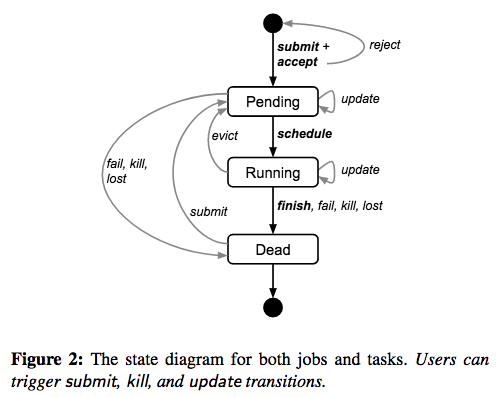

# Google 大规模集群管理器 Borg

* [Large-scale cluster management at Google with Borg](https://static.googleusercontent.com/media/research.google.com/zh-CN//pubs/archive/43438.pdf)

## Abstract

Google Borg 系统是一个集群管理器，运行着数千个应用程序的数以十万计的作业，跨多个由数万台机器组成的集群。

Borg 通过超配、进程级别资源隔离等，实现高效的资源利用率。支持应用高可用，最大限度的减少故障时间，并且可以通过调度策略降低相关故障发生的可能性。Borg 还提供了声明性工作规范语言，名称服务集成，实时作业监控以及分析和模拟系统行为的工具，简化用户操作。

## 1. Introduction

集群管理系统的内部代号是 Borg，它全程管理、调度、启动、重启以及监控 Google 运行的应用程序。

Borg 提供三个好处：

* (1) 向用户隐藏资源管理和故障处理的细节，用户只需专注于应用程序开发
* (2) 高可靠性和高可用性的操作，同时支持应用程序相关特性
* (3) 有效的在数以万计的机器上运行工作负载

## 2. The user persoective

Borg 的面向用户为运行 Google 应用程序和服务的 Google 开发者和系统管理员（Google 内部称为网站高可用工程师或者简写 SRE）。用户向 Borg 以作业（`jobs`）的方式提交工作，每个 job 由包含着相同程序的一个或多个任务（`tasks`）组成。每个 job 运行在一个 Borg `cell` (一组机器集合管理单元) 上。

### 2.1 The workload

Borg cells 包括两种类型的 workload。第一种是那些长时间运行的服务，并且对请求延迟敏感（几微秒到几百毫秒之间）。这类服务一般是直接面向终端用户的产品，如 Gmail、Google Docs 和 Web 搜索以及内部基础设施服务（如 BigTable）。另外一种是那些运行几秒或者几天即可完成的批处理作业，这类服务对短期性能波动不敏感。

一个典型的 cell，一般分配 70% CPU 资源，实际使用为 60%，分配 55% 的内存资源，实际使用为 85%。

### 2.2 Clusters and cells

一个 cell 的机器都归属于单个集群，通过高性能的数据中心级别的光纤网络连接。一个集群部署在一个独立的数据中心建筑中，多个数据中心建筑构成一个 `site`。一个集群通常包括一个大规模的 cell 和许多小规模的测试或者特殊目的的 cells。尽量避免单点故障。

排除测试 cells，一个中等规模的 cell 一般由 10k 机器组成。一个 cell 中的机器规格是不同的，诸如配置（CPU、RAM、磁盘、网络），处理器型号，性能等方面。用户无需关心这些差异，Borg 确定在哪个 cell 上运行任务，分配资源，安装程序和依赖项，并监控应用运行状况以及在运行失败时重启。

### 2.3 Jobs and tasks

一个 Borg job 的属性包括名字、属主以及 tasks 数量。通过一些约束，可以强制 Job 的 tasks 在具有特定属性的机器上运行，例如处理器架构、操作系统版本，或者额外的 IP 地址。约束是分软限制和强限制。可以指定 job 运行顺序，如一个 job 在另外一个 job 运行之后再启动。一个 job 只能运行在一个 cell 上。

每个 task 映射成一组 Linux 进程运行在一台机器的一个容器中。大部分的 Borg workload 都不是运行在虚拟机中，不想在虚拟化上花费精力是一方面。另外，设计 Borg 的时候还没有出现硬件虚拟化。task 也有拥有属性，例如资源需求等。大多数的 task 属性同它们的 job 一样，不过也可以被覆盖。如提供 task 专用的命令行参数，以及 CPU、内存、磁盘空间、磁盘 IO 大小、TCP 端口等都可以分配设置。用户通过 RPC 与 Borg 交互来操作 job，大多数是通过命令行工具完成的，其它的则通过监控系统。大部分 job 描述文件是用声明式配置语言 BCL (GCL 变体) 编写的。

用户可以修改一个运行中的 job 属性值并发布到 Borg，然后 Borg 按照新的 job 配置来更新 tasks。更新通常是以滚动方式完成，并且可以对更新导致的任务中断（重新调度或者抢占）的数量进行限制，任何导致更多中断的更改都会被跳过。

tasks 需要能够处理 Unix `SIGTERM` 信号，一遍在被强制发送 `SIGKILL` 之前，可以有时间进行清理，保存状态，完成当前执行请求，拒绝新的请求。在实践中，规定时间有 80% 的可以正常处理信号。

### 2.4 Allocs（allocation）

Borg `alloc` 是可以运行在一个或多个 tasks 的机器上的一组预留资源。无论资源是否使用，资源仍分配。Allocs 可以被用于将来的 tasks 资源使用，在停止和启动 task 之间保留资源，并且可以将不同 jobs 的 tasks 聚集到同一台机器上。一个 alloc 的资源和机器上资源类似的方式处理，多个 tasks 运行在 alloc 上是共享资源的，如果一个 alloc 必须重新分配到另外一台主机，它的 tasks 也会同它一起重新被调度。

一个 `alloc` 集合和 job 很像，它是一组分配在多台机器上的预留资源。一旦创建一个 alloc 集合，就可以提交一个或多个 jobs 运行在其中。为简洁起见，通常使用 "task" 引用 alloc 或者一个顶级的 task(alloc 之外的 task) 和 "job" 来引用一个 job 或者 alloc 集合。

### 2.5 Priority, quota, and adminssion control

优先级和配额用于防止运行的比实际能容纳多的这种负载情况。每个 job 都有一个 `priority` 优先级，一个小的正整数。高优先级的 task 可以在牺牲较低优先级的 task 来获取资源，甚至是以抢占方式。 Borg 为不同用途定义不同的优先级：监控、生产、批处理和 best effort。

针对生产级别的 jobs 是禁止 task 互相抢占的。优先级决定 jobs 在 cell 中处于运行还是等待状态。 `Quota` 配额被用于确定调度哪些 jobs。配额表示为一段时间内（通常为几个月）给定优先级的资源量（CPU、RAM、磁盘等）。这些值指定了用户的 job 在请求时间段内可以使用的最大资源量。配额检查是准入控制的一部分，配额不足情况下，job 会被拒绝调度。

高优先级的配额成本比低优先级要高。生产级别的配额仅限于 cell 中实际可用资源，因此用户提交满足生产级别 job 运行预期的资源配额。虽然不建议用户配置超买，但是很多用户都会比实际的需要配额要大，以防止后续用户增长可能造成的资源短缺。对于超买，应对方案就是超卖。

配额分配的使用在 Borg 之外进行处理，和物理容量设计密切相关，结果反映在不同数据中心的配额价格和可用性上。Borg 通过 capability 系统，给予某些用户特殊权限，如允许管理员删除或者修改任意 cell 中的 job，或者运行用户访问受限的内核功能或者 Borg 操作，如禁用其 jobs 预算。

### 2.6 Naming and monitoring

只是提供创建和运行是不够的，服务客户端和相关系统需要能够访问到对应的服务，即使被重新调度到新的机器上。因此，Borg 针对每个 task 创建一个稳定的 "Borg name service" (BNS)，包括 cell 名，job 名和 task 数量。Borg 用这个名字将 task 的主机名和端口写入到 Chubby 一致且高可用的文件中，该文件用于 RPC 系统查找 task 端。BNS 名也用于 task DNS 名构成基础，如用户 ubar 在 cell cc 上执行的 job jfoo 第 50 个 task，可以通过 50.jfoo.ubar.cc.borg.google.com 访问。Borg 还会在发生变化的时候把 job 大小和 task 健康信息写入到 Chubby，以使得负载均衡器可以获取到请求路由指向。

几乎所有运行在 Borg 上的 task 都包含一个内建的 HTTP server，用于发布 task 的健康信息和数千个性能指标（如 RPC 延迟）。Borg 监控健康检测 URL 并且在 tasks 无响应或者返回错误的 HTTP 码时重启。其它的数据会被监控工具追踪展示在 Dashboards 上并且在服务级别（SLO）问题时告警。

用户可以通过一个名叫 Sigma 提供的 Web 用户界面上，检查 jobs 的状态，查看特定的 cell，或者深入查看各个 jobs 和 tasks，检测它们的资源占用，详细的日志和执行历史，以及最终的宿命。应用程序会产生大量的日志，通过日志轮转避免磁盘空间不足，并且在任务退出后保留一段时间以协助进行调试。如果一项工作没有运行，Borg 会提供一个 “有待处理的” 注释，以及如何修改 job 资源请求用以更好的适配 cell。

Borg 记录所有 job 提交和 task 事件，详细到每个 task 资源使用信息记录在基础设施存储。这是一个可伸缩的只读数据存储，并且由 Dremel（Google 交互式数据分析系统）提供类 SQL 方式进行交互。数据被用于计费，调试 job 和系统故障以及长期的容量规划。它也提供 Google 集群工作负载跟踪数据。

所有的这些特性帮助用户理解和调试 Borg 以及他们的 jobs，并且帮助我们的 SREs 每人管理数万台主机。

## 3. Borg architecture

一个 Borg cell 由一组主机组成，一个名为 Borgmaster 的逻辑集中控制器，和一个名为 Borglet 的代理进程组成，Borglet 运行在 cell 中的每个主机上。所有的 Borg 组件都是通过 C++ 编写的。

### 3.1 Borgmaster

每个 cell 的 Borgmaster 包含两个进程：主 Borgmaster 进程和一个独立的调度器。主 Borgmaster 进程处理客户端 RPCs 请求，状态变化（如创建 job）或者提供数据的只读访问（如查找 job）。它还管理系统中所有对象的状态（如主机，tasks，allocs 等），和 Borglets 通信，并提供一个 Web UI 作为 Sigma 的备份。

Borgmaster 在逻辑上是一个单一的进程，但是实际上它有五个副本。每个副本都维护一大部分 cell 状态的内存副本，并且这个状态以高可用，分布式，基于 Paxos 存储保存在副本所在的本地磁盘上。每个 cell serves 选举出的 master，作为 Paxos 主导和状态 mutator，处理所有变更 cell 状态的操作，例如在某台主机上提交一个 job 或者终止一个 task。

master 在当 cell 启动和选举的 master 失效时选举（通过 Paxos）；它活得一个 Chubby 锁，以便其它系统可以找到它。选择一个 master 并故障转移到新设备大概需要 10s，但是在大型 cell 中因为内存状态的重建，这个时间可能需要一分钟。当副本从中断中恢复时，它会动态的从其它最新的 Paxos 副本重新同步状态。

Borgmaster 在某个时间点的状态称为 checkpoint，采用定期快照以及保存更改日志在 Paxos 存储。Checkpint 有多个用途，包括将 Borgmaster 的状态恢复到过去的任意点（例如，在接收触发 Borg 中的软件缺陷请求前调试）；在极端情况下需要手动维护；为将来的查询构建持久的事件日志和离线模拟。

一个名为 Fauxmaster 的高保真 Borgmaster 模拟器可以用于读取 checkpoint 文件，并包含生产 Borgmaster 代码的完整副本，以及 Borglets 的存根接口。它接收 RPCs 来进行状态机变更和执行操作，如 “调度所有待处理的任务”，我们使用它来调试失败，通过与它进行交互就好像它是一个实时 Borgmaster，利用 checkpoint 文件模拟 Borglets 重放真实交互。用户可以按步执行并观察过去实际发生的系统状态变化。Fauxmaster 还可以用于容量规划（“这种类型的新 jobs 多少适合？”），以及在变更 cell 配置前进行健全性检查（“这次变更是否会驱逐其它重要的 jobs？”）。

### 3.2 Scheduling

当提交一个 job 后，Borgmaster 会将它永久记录在 Paxos 存储中并将 job 的 tasks 加入到待处理队列。调度器异步遍历，如果有足够的可用资源满足 job 的需求，则分配 tasks 到主机。(调度器主要针对 tasks 操作，而不是 jobs。)遍历优先级从高到低，在优先级内通过轮询方案进行调制，确保用户之间的公平性，避免在阻塞大型 job 后。调度算法有两部分组成：可行性检查，通过选择一个可行性机器评分寻找 task 可运行的主机。在可行性检查中，调度器找到一组满足 task 需求的主机以及足够的可用资源 -- 其中包括分配给可以驱逐的优先级较低的任务资源。在评分中，调度器确保每个可行性主机的“良好性”。评分综合了用户指定的首选项，但主要由内置条件驱动，例如最小化抢占 tasks 的数量和优先级，挑选已拥有 task 副本包的主机，在 power 和故障域之间传播 task 以及 packing 质量，包括将高优先级和低优先级任务混布到一台机器，以允许高优先级任务在负载峰值扩展。

Borg 最初使用 E-PVM 的一种变体进行评分，它可以跨异构资源生成单一成本值，并在放置 task 时最小化成本变化。在实践中，E-PVM 最终会在所有的主机上分散负载，为负载峰值留下空间 - 但代价是增加了碎片化，特别针对需要大多数主机的大型 tasks；我们有时称之为“最糟糕的”。

对应的另外一端则是“最佳匹配”，尝试尽可能紧密的填充主机。这使得一些主机没有用户 jobs 运行（它们仍然运行存储服务器），因此放置大型 tasks 很简单，但是严密的 packing 会导致用户或者 Borg 对资源需求的误估。这会破坏具有突发负载的应用程序，对于指定低 CPU 请求的批处理 jobs 尤其糟糕。20% 的非生产 tasks 请求小于 0.1 核 CPU，因此它们可以轻松调度并尝试在未使用的资源中机会性运行。

我们当前的评分模型是一个混合模型，它试图减少搁浅资源的数量 - 因为机器上的另外一个资源被完全分配而无法使用。他提供的 packing 效率比最适合我们的 workload 的高 3-5%。

如果评分阶段选择的主机没有足够的可用资源来适用新 task，Borg 会抢占（kills）低优先级的 tasks，从低到高优先级，直到可行。我们将抢占的 tasks 添加到调度器的待处理队列中，而不是迁移或者休眠它们。

Task 启动延迟（时间从 job 提交到 task 运行）是已经接收并继续受重视的区域。它变数很大，中位数通常约为 25s，软件包安装占 80%：已知瓶颈之一是本地磁盘写入软件包的竞争。为了减少任务启动时间，调度器更倾向把任务分配到已安装必要软件包（程序和数据）的主机：大多数软件包是不可变的，因此可以共享和缓存。（这是 Borg 调度器支持的唯一数据方形式。）此外，Borg 使用树和类似 toreent 的协议将程序包并行分发到主机。

另外，调度器使用多种技术使其扩展到数万台主机的 cells。
