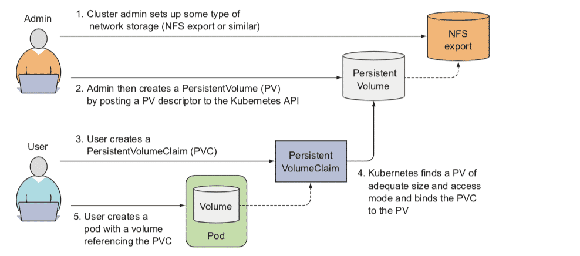
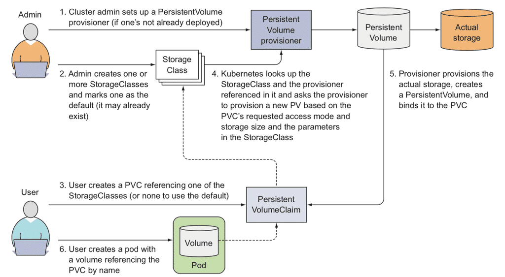

# 持久性卷（Persistent Volumes）

* [Persistent Volumes 官方说明](https://kubernetes.io/docs/concepts/storage/persistent-volumes/)

---

## 介绍

为管理存储，K8s 引入了两个新的资源对象：`PersistentVolume` 和 `PersistentVolumeClaim`。

`PersistentVolume`(PV) 是集群中管理员分配的一块存储。它属于集群中的资源，如同节点是集群中的资源一样，它不属于任何 Namespace。PVs 是存储卷插件，它拥有生命周期，但是独立于那些使用 PV 的 Pod 生命周期。支持 NFS、iSCSI 或者云供应商存储系统。

`PersistentVolumeClaim`(PVC) 用于用户请求存储资源。它类似 Pod，Pod 消耗节点资源，而 PVC 消耗 PV 资源。Pods 可以请求特定级别的资源（CPU 和 内存），PVC 可以请求特定的存储大小和访问模式（如可以一次读写挂载或只读模式）。

> 图摘自 [Kubernetes in action](https://www.manning.com/books/kubernetes-in-action)

### PersistentVolumes

#### 容量

当前，仅支持存储大小请求设置，未来可能包括 IOPS、吞吐量等。

#### 访问模式

* ReadWriteOnce(RWO) - 卷只能被一个节点读写挂载
* ReadOnlyMany(ROX) - 卷可以被多个节点以只读方式挂载
* ReadWriteMany(RWX) - 卷可以被多个节点读写挂载

#### Class

一个 PVC 可以通过 `storageClassName` 字段指定 [StorageClass](https://kubernetes.io/docs/concepts/storage/storage-classes/) 的名称来请求特定 class。只有所请求 class 的 PVs 才能绑定到请求指定相同 class 的 PVCs。


早期版本，使用 annotation `volume.beta.kubernetes.io/storage-class` 替代 `storageClassName`。当前 annotation 依然生效，不过在后续版本会被废弃。


#### 状态

* Available – 可用 PV，未绑定任何 PVC
* Bound – 已经绑定相关 PVC
* Released – PVC 被删除，资源还未被回收
* Failed – 动态回收失败

### PersistentVolumeClaims

#### Class

同 `PersistentVolume`，`PersistentVolumeClaim` 可以通过 `storageClassName` 指定 [StorageClass](https://kubernetes.io/docs/concepts/storage/storage-classes/) 的名字。只有同 PVC 相同 `storageClassName` 的 PVs，才可以绑定到此 PVC。

## 卷和声明的生命周期

PVs 是集群中的资源，PVCs 是对这些资源的请求，它们遵循以下生命周期：

### 供应

可以通过两种方式配置 PVs：静态或者动态方式。

__静态__

集群管理员创建一定数量的 PVs，它们包括可供集群用户使用实际存储的详细信息。

__动态__

当用户的 `PersistentVolumeClaim` 没有匹配到管理员创建的 PVs 时，集群可能会尝试为 PVC 专门配置动态卷。这种动态提供基于 `StorageClasses`：PVC 请求 [storage class](https://kubernetes.io/docs/concepts/storage/storage-classes/) ，storage class 由管理员创建和配置以达到动态提供的目的。

> 图摘自 [Kubernetes in action](https://www.manning.com/books/kubernetes-in-action)

为了开启基于 storage class 的动态存储，集群管理员需要在 API server 上启用 `DefaultStorageClass` [admission controller](https://kubernetes.io/docs/reference/access-authn-authz/admission-controllers/#defaultstorageclass)。确认 `DefaultStorageClass` 在 `--enable-admission-plugins` 逗号分隔的参数列表中。


在 1.10.x 及以上版本控制选项为 `--enable-admission-plugins`，而 1.9.x 及以下版本为 `--admission-control`。


### 绑定

用户在动态卷下创建或者已经创建了具有请求特定存储大小与访问模式的 `PersistentVolumeClaim` 情况下，主控制器中的控制回环监视新的 PVCs，并匹配 PV（如果能匹配到），然后绑定它们在一起。如果一个 PV 动态提供一个新的 PVC，那么该 PV 总是会绑定此 PVC。一旦绑定之后，无论是如何绑定的，`PersistentVolumeClaim` 绑定都是独占的，PVC 到 PV 绑定是一对一映射的。

如果匹配的卷不存在，PVC 将一直处于未绑定状态，直到匹配的卷可用。

### 使用

Pods 使用声明作为卷，集群通过检查声明关联卷并挂载卷到 pod。当一个用户拥有一个 PVC 并且已经处于绑定状态，那么绑定的 PV 只要用户需要，会一直属于他。用户通过他们 Pod volumes 块的 `persistentVolumeClaim` 调度和访问他们声明的 PVs。

### 回收

当用户使用完存储卷，他们可以通过 API 删除 PVC 对象允许资源回收。`PersistentVolume` 回收策略定义集群在 PVC 释放后如何处理，当前支持保留、回收或者删除。

__保留__

`Retain` 回收策略允许手动回收资源，当 `PersistentVolumeClaim` 删除后，`PersistentVolume` 仍然存在并处于 "Released" 状态。因为之前声明的数据仍然存在卷上，PV 依然不能被其它 PVC 绑定。管理员可以通过以下操作回收卷：

* 1、删除 `PersistentVolume`。删除后，关联的存储在外部基础设施（例如 AWS EBS，GCE PD，Azure Disk 或者 Cinder 卷）依然存在
* 2、手动清理相关存储数据
* 3、手动删除相关存储资产，或者如果需要重用，可以重新创建一个新的 `PersistentVolume`

__删除__

对于支持 `Delete` 回收策略的卷插件，删除会移除 `PersistentVolume`，以及外部关联的存储资源，如 AWS EBS、GCE PD、Azure Disk 或者 Cinder 卷。 `StorageClass` 默认的回收策略为 `Delete`，管理员应该根据用户的期望配置该选项，否则需要更新 PV 策略 [Change the Reclaim Policy of a PersistentVolume](https://kubernetes.io/docs/tasks/administer-cluster/change-pv-reclaim-policy/)。

__回收__

使用 `Recycle` 回收策略，会自动清理数据并使其可以被其它新的声明使用。（当前只有 NFS 和 HostPath 支持回收）


`Recycle` 回收策略已经被废弃，推荐使用动态供应代替（即 `StorageClass`）

