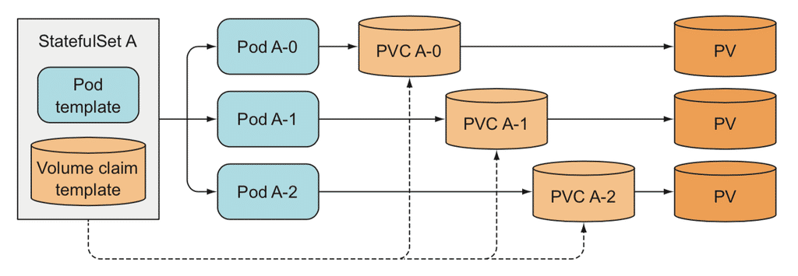

# StatefulSets

* [StatefulSets 官方说明](https://kubernetes.io/docs/concepts/workloads/controllers/statefulset/#deployment-and-scaling-guarantees)

---

一个标准的 StatefulSet 由 `Pod template` 和 `Volume claim template` 组成：

> 图摘自 [Kubernetes in action](https://www.manning.com/books/kubernetes-in-action)

## 说明

* StatefulSet 在 K8s 1.9 版本正式 GA，1.9 之前属于 beta 版本，1.5 之前的版本则不可用
* Pod 所需的存储要么基于 [PersistentVolume Provisioner](https://github.com/kubernetes/examples/tree/master/staging/persistent-volume-provisioning/README.md) 请求的 `stogage class` 动态获取，要么通过管理员预先提供
* 删除或者缩容一个 StatefulSet 将不会删除绑定的存储卷。这么做是为了保证数据安全
* StatefulSet 依赖 [Headless Service](https://kubernetes.io/docs/concepts/services-networking/service/#headless-services) 处理 Pods 的网络标识

## 部署和扩容缩容保障

* 如果一个 StatefulSet 有 N 个 replicas（副本），Pod 按照 {0..N-1} 的顺序部署
* 当 Pods 被删除时，则按照 {N-1..0} 的顺序终止
* 在扩容缩容操作应用到 Pod 时，之前的实例都是运行和准备就绪的
* 在 Pod 终止前，它的继任者都必须完全关闭状态

StatefulSet `pod.Spec.TerminationGracePeriodSeconds` 值不应该指定为 `0`。

## 组件

* Headless Service 用于域名注册
* volumeClaimTemplates 用于提供存储

### Pod 选择器

必须指定 `.spec.selector` 字段匹配 `.spec.template.metadate.labels`。在 Kubernetes 1.8 之前，`.spec.selector` 字段如果为空则取默认值。在 1.8 以及之后版本，不指定则报错。

### Pod 标识

StatefulSet Pod 具有唯一的标识，由序数、稳定网络标识和稳定存储组成，无论其被调度到哪个节点。

__序数索引__

对于拥有 N 副本的 StatefulSet，StatefulSet 的每个 Pod 将被分配一个整数序数，从 0 到 N-1，在副本集中是唯一的。

__稳定的网络 ID__

StatefulSet 中的每个 Pod 都从 StatefulSet 的名称和 Pod 序号派生出主机名。构造的主机名的模式是 $(statefulset name)-$(ordinal)。StatefulSet 可以通过 [Headless Service](https://kubernetes.io/docs/concepts/services-networking/service/#headless-services) 管理 Pods 的域名，域名的格式为： $(service name).$(namespace).svc.cluster.local，其中 `cluster.local` 为集群域，以实际设置为主。作为每个创建的 Pod，它获取匹配的 DNS 子域，格式为：$(podname).$(governing service domain)，其中，governing service 通过 StatefulSet 的 `serviceName` 字段定义。以下为官方示例中对应关系：

| Cluster Domain | Service(ns/name) | StatefulSet(ns/name) | StatefulSet Domain | Pod DNS | Pod Hostname
| :-- | :-- | :-- | :-- | :-- | :--
| cluster.local | default/nginx | default/web | nginx.default.svc.cluster.local | web-{0..N-1}.nginx.default.svc.cluster.local |	web-{0..N-1}
| cluster.local	| foo/nginx	| foo/web | nginx.foo.svc.cluster.local	| web-{0..N-1}.nginx.foo.svc.cluster.local |web-{0..N-1}
| kube.local | foo/nginx |	foo/web | nginx.foo.svc.kube.local | web-{0..N-1}.nginx.foo.svc.kube.local | web-{0..N-1}

### Pod 管理策略

K8s 1.7 之后，StatefulSet 通过 `.spec.podManagementPolicy` 字段可以设置是否严格按照顺序部署和扩容缩容操作。

__`OrderedReady` Pod 管理__

`OrderedReady` pod 管理是默认的 StatefulSets 策略，保障了有序部署和扩容缩容。

__`Parallel` Pod 管理__

`Parallel` pod 管理指定 StatefulSet 控制器并行运行和终止 Pods，而不是等待 Pods 运行和准备就绪再运行或者终止完上一个 Pod 再终止另外一个。

## 更新策略

K8s 1.7 之后，StatefulSet 通过 `.spec.updateStrategy` 字段允许用户配置和禁用 Pods 自动滚动更新容器、标签、资源限制以及注释。

### `OnDelete`

`OnDelete` 更新策略实现了旧的（1.6 或之前的版本）更新方式，当一个 StatefulSet 的 `.spec.updateStrategy.type` 设置为 `OnDelete` 时，StatefulSet 控制器将不会自动更新 StatefulSet 中的 Pods。在修改 `.spec.template` 后，用户必须手动删除 Pods 以触发控制器创建新的 Pods。

### `RollingUpdate`

`RollingUpdate` 更新策略实现了在 StatefulSet 中自动、滚动更新 Pods。当 `.spec.updateStrategy` 没有定义的时候，默认就是 `RollingUpdate` 策略。当 StatefulSet `.spec.updateStrategy.type` 设置为 `RollingUpdate` 时，StatefulSet 控制器在有变更的时候会删除和重建 StatefulSet 中的每一个 Pod。它将以 Pod 终止（从最大序数到最小序数）的顺序进行，一次更新一个 Pod。在继续更新前会等待更新的 Pod 运行直接准备就绪。

__`Patition`__

`RollingUpdate` 更新策略可以分区操作，通过指定 `.spec.updateStrategy.rollingUpdate.partition` 选项。如果指定了分区，则更新 StatefulSet 的 `.spec.template` 时，将更新序数大于或者等于该分区的所有 Pods。序数小于分区的所有 Pods 都不会更新，即使被删除，也会以之前的版本重建。如果 StatefulSet 的 `.spec.updateStrategy.rollingUpdate.partition` 大于 `.spec.replicas`，则即使 `.spec.template` 更新了，Pods 也不会被更新。


大多数情况下是不需要使用分区的，但是如果有金丝雀或者分阶段更新需求，那么分区将会很有用。

