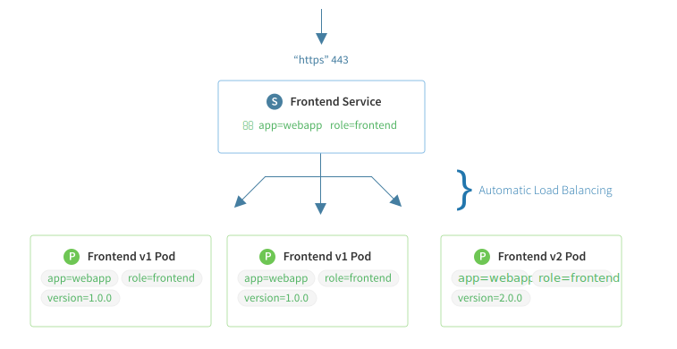

# Kubernetes 术语

## Namespaces

同一个 Kubernetes 物理集群支持多个虚拟集群，而这个虚拟集群的概念就是 namespaces。这是官方的介绍，官方的介绍多少有点让人不那么容易理解。简单来说，namespaces 可以认为是一个环境或者项目组的概念，namespaces 下创建操作相应的服务。每个 namespaces 都是逻辑隔离的，针对指定 namespaces 可以做相应的资源（CPU、Memory 等）限制以及用户权限控制（RBAC）。namespaces 名字是全局唯一的。

> **[info] 标注**  
> 针对同一软件的不同版本，官方是不建议启用多个 namespaces 的，而是推荐在同一个 namespaces 下使用 `labels` 去区分标识。不过，这还是得看情况，针对多环境不同版本测试来说，还是采用多个 namespaces 比较好，方便隔离。

Kubernetes 集群创建之后会看到三个初始化 namespaces：

- `default` 默认 namespace
- `kube-system` Kubernetes 系统 namespace
- `kube-public` 用于集群中所有用户都可读的 namespace，是个惯例做法，但是非必须的

## Pods

Pods 是 Kubernetes 中创建和管理的最小可部署计算单元，一个 pod 是由一个或者多个容器组成（如 Docker 容器），pod 中的容器共享存储、网络。

## ReplicaSet (RS) and ReplicationController (RC)

单个部署 pod，如果 pod 因为一些因素异常退出了，pod 本身是不会自动恢复的。RS 和 RC 则担任管理 pod 状态的角色，RS 和 RC 的机制保证通过它们管理的 pod 保持固定的副本数并持续运行。如果 pod 因异常原退出了，那么 RS 或 RC 会请求创建新的 pod。

> **[info] 标注**  
> 需要注意的是，ReplicationController 已经被 ReplicaSet 替代

## Deployments

Deployments 提供了 pod 和 ReplicaSets 的更新声明。一般情况下不需要单独创建 ReplicaSet，而是直接通过创建 Deployments，由 Deployments 创建管理 ReplicaSet。此外，Deployments 还提供了滚动更新、回滚、暂停、恢复等功能。

## StatefulSets

StatefulSets 同 Deployments/Replicas 类似，相较于 Deployments/ReplicaSets 对应无状态服务，StatefulSets 则针对有状态服务。StatefulSets 适用于以下特性的应用：

* 稳定唯一的网络标识
* 稳定持久性存储
* 有序优雅的部署和扩展
* 有序优雅的删除和销毁
* 有序自动更新

## Jobs and CronJob

Jobs 用于一次性的部署任务，可以是一个或者多个 Pods。Pods 成功执行后，Jobs 本身也完成了。如运行单元测试、一次性的脚本运行等等都可以使用 Jobs 来做。CronJob 顾名思义，则是定时执行的一种 Job。

## Services

因为 K8s 中 pod 的 ip 是不固定的，那么应用之间就不能单纯的简单靠 ip 来访问，另外有些应用拥有多个副本。因此，K8s 引入了 Services 的抽象，Services 简单可以理解为一个负载均衡器，每个 Services 都拥有一个名字和 vip，通过 Label 来对应一个或者一组 pods，集群内部的应用通过 Services name 直接访问对应的应用。

> 图引用自 [CoreOS Overview of a Service](https://coreos.com/kubernetes/docs/latest/services.html)

## Ingress

Services 用于内部集群应用间调用，Ingress 定义则为了集群内部服务暴露到外部访问。单纯创建 Ingress 还不够，需要结合 Ingress controller 才能真正实现服务的外部暴露。当前 Ingress controller 有 [ingress-nginx](https://github.com/kubernetes/ingress-nginx)、[Traefik](https://github.com/containous/traefik) 等。

## Configmap

Configmap 提供键值对存储，一般用于静态配置文件或者环境变量配置等。
