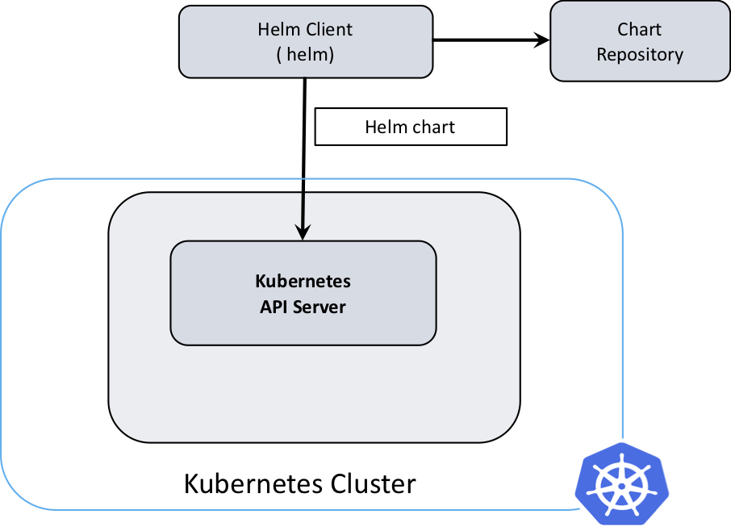

# Helm 架构

> https://developer.ibm.com/technologies/containers/blogs/kubernetes-helm-3/

## HELM 的目的

Helm 是一个管理 Kubernetes 包 charts 的工具。Helm 可以做以下事情：

+ 从 scratch 创建新的 charts
+ 打包 charts 为归档（tgz）文件
+ 与 chart 仓库进行交互
+ 在已存在的 Kubernetes 集群中安装和卸载 charts
+ 管理已安装 charts 的 release 生命周期

对于 Helm，这里有三个重要的概念：

+ 1、chart 包含创建一个 Kubernetes 应用实例所必要的信息
+ 2、config 包含可以合并到 chart 包创建可发布对象的配置信息
+ 3、release 是 chart 的运行实例，包含指定的配置

## 组件

Helm 是一个由两个不同部分实现的可执行文件：

__The Helm Client__ 是提供终端用户的命令行客户端。客户端负责以下功能：

+ 本地 chart 开发
+ 管理 repositories
+ 管理 releases
+ 对接 Helm library 仓库
    - 发送要安装的 charts
    - 请求升级或者卸载已存在的 releases

__The Helm Library__ 提供了执行所有 Helm 操作的逻辑。它与 Kubernetes API 服务器交互并提供以下功能：

+ 结合 chart 和配置以构建一个 release
+ 在 Kubernetes 中安装 charts，并提供后续的 release 对象
+ 通过与 Kubernetes 交互来升级或者卸载 charts

独立的 Helm library 封装了 Helm 逻辑，以便可以由不同的客户端使用。

## 实现

Helm client 和 library 通过 Go 语言编写。

library 使用 Kubernetes client library 连接 Kubernetes。当前，library 使用 RESET + JSON。它使用 Kubernetes 内部的 Secrets 来存储信息。它不需要自己的数据库

配置文件尽可能以 YAML 编写。

