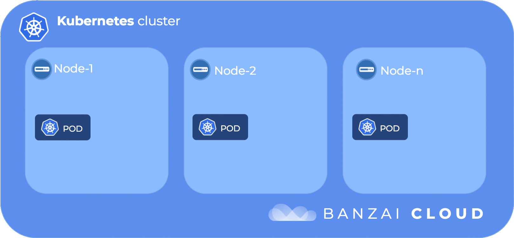

# 污点（Taints）和容忍度（Tolerations）

+ [Taints and Tolerations](https://kubernetes.io/docs/concepts/configuration/taint-and-toleration/)

节点亲和性（affinity），是 pods 的一种属性，可以将 pods 调度到一类节点上去（作为优先选择或者一个硬性要求）。污点（Taints）则相反，它们允许节点排斥一类 pods。

Taints 和 tolerations 一起工作以确保 pods 不调度到不适合的节点上去。一个或者多个 taints 规则应用于节点，这标记节点不会接受任何没有容忍这些 taints 规则的 pods。Tolerations 规则应用于 pods，并且允许（非强制）这些 pods 调度到匹配 taints 规则的节点上。

## 概念

可以通过 [kubectl taint](https://kubernetes.io/docs/reference/generated/kubectl/kubectl-commands#taint) 给节点添加一个 taint 规则。如：

```
kubectl taint nodes node1 key=value:NoSchedule
```

给节点 `node1` 标记了一个 taint。这个 taint 包含键 `key`，值 `value`，以及 taint effect `NoSchedule`。这意味着没有 pod 能够调度到 `node1` 上，除非它有匹配的 toleration。

如果要移除刚刚添加的 taint，可以运行：

```
kubectl taint nodes node1 key:NoSchedule-
```

你可以在 PodSpec 字段指定一个 toleration。以下两个 tolerations 都匹配上面通过 `kubectl taint` 创建的 taint，因此有任何一个 toleration 都可以调度到 `node1`：

```
tolerations:
- key: "key"
  operator: "Equal"
  value: "value"
  effect: "NoSchedule"
```

```
tolerations:
- key: "key"
  operator: "Exists"
  effect: "NoSchedule"
```

这儿有一个 pod 使用 tolerations 的例子：

```
apiVersion: v1
kind: Pod
metadata:
  name: nginx
  labels:
    env: test
spec:
  containers:
  - name: nginx
    image: nginx
    imagePullPolicy: IfNotPresent
  tolerations:
  - key: "example-key"
    operator: "Exists"
    effect: "NoSchedule"
```

如果在 `key` 和 `effect` 相同的情况下，toleration 则匹配 taint，其中：

+ `operator` 是 `Exists`（在这种情况下不应指定任何 `value`），或
+ `operator` 是 `Equal` 或 `value` 相等

如果不指定 `operator`，默认为 `Equal`。

> __注意：__
> 这里有两个特殊的案例：
>  
> + `key` 为空，`operator` 是 `Exists` 则匹配所有的键值和效果，意味着可以 tolerate 一切。
>
> ```
> tolerations:
> - operator: "Exists"
> ```
>
> + 一个空的 `effect` 匹配所有键为 `key` 的效果。
>
> ```
> tolerations:
> - key: "key"
>   operator: "Exists"
> ```

上面的例子使用了 `effect` 为 `NoSchedule`。或者，你可以使用 `effect` 为 `PreferNoSchedule`。这是 `NoSchedule`  的 “优先选项” 或者 “软” 版本 -- 系统会尝试避免调度一个没有容忍 taint 的 pod 到该节点上，但是这不是强制的。第三种类型的 `effect` 是 `NoExecute`，后面再描述。

你可以在同一个节点上设置多个 taints，也可以在同一个 pod 上设置多个 tolerations。Kubernetes 处理多个 taints 和 tolerations 的方式就像一个过滤器：遍历一个节点上的所有 taints，然后忽略 pod 上有匹配 toleration 的 taints。其它未忽略的 taints 会对 pod 产生作用。特别是：

+ 如果至少有一个 `effect` 是 `NoSchedule` 的未忽略的 taint，那么 Kubernetes 将不会在该节点上调度这个 pod
+ 如果没有 `effect` 是 `NoSchedule` 的未忽略 taint，但至少有一个 `effect` 是 `PreferNoSchedule` 的未忽略的 taint，那么 Kubernetes 会尝试不让该 pod 调度到此节点上
+ 如果有至少一个 `effect` 是 `NoExecute` 的未忽略 taint，那么 pod 会从该节点上驱离（如果 pod 已经运行在该节点），并且不会被调度到该节点（如果 pod 没有在节点运行）。

举例来说，有个节点有如下 taint：

```
kubectl taint nodes node1 key1=value1:NoSchedule
kubectl taint nodes node1 key1=value1:NoExecute
kubectl taint nodes node1 key2=value2:NoSchedule
```

pod 有两个 tolerations：

```
tolerations:
- key: "key1"
  operator: "Equal"
  value: "value1"
  effect: "NoSchedule"
- key: "key1"
  operator: "Equal"
  value: "value1"
  effect: "NoExecute"
```

这个案例，pod 不会被调度到这个节点上，因为 pod 没有匹配第三个 taint。但是如果在节点添加 taint 的时 pod 已经运行了，那么 pod 会继续在该节点运行（简单说 `NoSchedule` 只在调度时生效）。

正常情况下，如果一个 `effect` 是 `NoExecute` 的 taint 添加到节点，那些没有容忍此 taint 的将会被直接驱逐，然后那些容忍这个 taint 的 pods 将永远不会被驱逐。另外，一个 `effect` 是 `NoExecute` 的 toleration 可以指定一个可选的 `tolerationSeconds` 字段，以指示当节点 taint 被添加之后 pod 运行在节点的时长，如：

```
tolerations:
- key: "key1"
  operator: "Equal"
  value: "value1"
  effect: "NoExecute"
  tolerationSeconds: 3600
```

意思是 pod 在节点运行时，当一个匹配的 taint 被添加到该节点后，那么这个 pod 将继续在当前节点运行 3600s，之后会被驱逐。如果 taint 在时间到达之前被移除，那么 pod 不会被驱逐。

## 用例

Taints 和 tolerations 是一种灵活的方式，将 pod 从节点上移除或驱逐不应运行的 pods。

+ __专用节点：__ 如果你想将一组节点给一类特定的用户使用，你可以在这些节点上添加 taint（也就是说，`kubectl taint nodes nodename dedicated=groupName:NoSchedule` ）并且在他们的 pods 上添加 toleration（通过自定义[准入控制器](https://kubernetes.io/docs/reference/access-authn-authz/admission-controllers/)会更容易做到）。这些拥有 tolerations 的 pods 将被允许使用 tainted 的节点以及集群中的其它节点。如果你想要专门使用这些节点并确保只会使用这些节点，那么还需要像给这组节点添加 taint 一样添加一个标签（如，`kubectl label nodes nodename edicated=groupName`），并且准入控制器还要添加一个节点 affinity，以要求 pods 只能调度到有 `dedicated=groupName` 标签的节点上。
+ __拥有特定硬件的节点：__ 在一小部分节点具有专用硬件（如 GPU）的集群中，最好将不需要专用硬件的 pods 排除在这些节点之外，从而为专用硬件的 pods 留出空间。这个可以通过给特定硬件的节点添加 taint（如 `kubectl taint nodes nodename special=true:NoSchedule` 或者 `kubectl taint nodes nodename special=true:PreferNoSchedule`）并在需要使用这些特定硬件的 pods 上添加相应的 toleration。像在专用节点用例中一样，使用自定义准入控制器来应用 tolerations 可能是最简单的。举例来说，推荐使用 Extended Resources[](https://kubernetes.io/docs/concepts/configuration/manage-resources-containers/#extended-resources) 来表示特殊硬件，用扩展资源的名称 taint 你的特定硬件并且运行 [ExtendedResourceToleration](https://kubernetes.io/docs/reference/access-authn-authz/admission-controllers/#extendedresourcetoleration) 准入控制器。现在，因为节点已经被 tainted，没有相应 toleration 的 pods 不会被调度到这些节点，`ExtendedResourceToleration` 准入控制器会自动的向 pods 添加正确的 toleration，然后 pod 将会被调度在这些特定硬件的节点上。这样可以确保这些特定硬件的节点被请求此类硬件的 pods 使用，而你不需要手动向 pods 中添加 tolerations。
+ __通过 taint 驱逐：__ 节点出现问题时，可以按每个节点配置驱逐行为，这个后面详解。

## 通过 taint 驱逐

前面我们提到了 `NoExecute` taint `effect`，它会影响已经运行在节点的 pods：

+ 没有相应 tolerations 的 pods 将会被直接驱逐
+ 有相应 tolerations 并且未指定 `tolerationSeconds` 的 pods 永远保持运行
+ 有相应 tolerations 且指定 `tolerationSeconds` 的 pods 会在时间到达之后被驱逐

此外，Kubernetes 1.6 时以 alpha 状态引入该功能来支持表示节点问题。换句话说，当满足特定条件时，节点控制器会自动对节点进行 taints。以下为内建的 taints：

+ `node.kubernetes.io/not-ready`：节点没有就绪。对应 NodeCondition `Ready` 为 "False"
+ `node.kubernetes.io/unreachable`：从节点控制器无法访问到节点。对应 NodeCondition `Ready`为 `Unknown`
+ `node.kubernetes.io/out-of-disk`：节点磁盘空间不足
+ `node.kubernetes.io/memory-pressure`：节点内部有压力
+ `node.kubernetes.io/disk-pressure`：节点磁盘有压力
+ `node.kubernetes.io/network-unavailable`：节点网络不可达
+ `node.kubernetes.io/unschedulable`：节点不可调度
+ `node.cloudprovider.kubernetes.io/uninitialized`：当使用外部 cloud provider 启动 kubelet 时，将节点设置 taint 以标记为不可用。来自 cloud-controller-manager 的控制器初始化此节点后，kubelet 删除此 taint。

如果要驱逐节点，则节点控制器或者 kubelet 会添加具有 `NoExecute` 的 `effect` 相关 taints。如果故障情况恢复正常，则 kubelet 或节点控制器会移除相关的 taints。

> __注意：__ 为了维持由于节点问题导致驱逐的速率限制行为，系统实际以速率限制的方式添加 taints。 这样可以防止主节点和节点连接中断发生大规模的 pod 驱逐。

该功能和 `tolerationSeconds` 结合使用，允许一个 pod 指定当一个或者多个问题的时候在节点运行的时间。

例如，一个具有很多本地状态的应用在网络中断事件中像停留一段事件，以期望网络能够恢复，这样可以避免 pod 被驱逐。这个 pod 的 toleration 设置可以如下：

```
tolerations:
- key: "node.kubernetes.io/unreachable"
  operator: "Exists"
  effect: "NoExecute"
  tolerationSeconds: 6000
```

注意 Kubernetes 会自动添加一个 `node.kubernetes.io/not-ready` 且 `tolerationSeconds=300` 的 toleration，除非 pod 配置中已经设置 `node.kubernetes.io/not-ready` 的 toleration。同样的它会添加一个 `node.kubernetes.io/unreachable` 且 `tolerationSeconds=300` 的 toleration，除非 pod 配置中已经设置 `node.kubernetes.io/unreachable` 的 toleration。 

这些自动添加的 tolerations 确保在检测到这些问题之后，pod 默认会在当前节点保留运行 5 分钟。这两个默认 tolerations 被 [DefaultTolerationSeconds admission controller](https://git.k8s.io/kubernetes/plugin/pkg/admission/defaulttolerationseconds) 添加。

DaemonSet 创建含有 `NoExecute` tolerations 的 pods 针对以下 taints 没有 `tolerationSeconds` 选项：

+ `node.kubernetes.io/unreachable`
+ `node.kubernetes.io/not-ready`

这样可以确保 DeamonSet pods 不会因为这些问题而被驱逐。

## 根据节点状态 taint

节点生命周期控制器自动会为对应节点状态的节点创建 `effect` 为 `NoSchedule` 的 taints。同样调度器不会检查节点状态，而是检查 taints。这样可以保证节点状态不会影响到已调度的 pods。用户可以通过添加适当的 Pod tolerations 以选择忽略某些节点问题。

从 Kubernetes 1.8 开始，DaemonSet 控制器自动给所有的 daemons 添加 `NoSchedule` tolerations，以阻止 DaemonSets 中断。

+ `node.kubernetes.io/memory-pressure`
+ `node.kubernetes.io/disk-pressure`
+ `node.kubernetes.io/out-of-disk (only for critical pods)`
+ `node.kubernetes.io/unschedulable (1.10 or later)`
+ `node.kubernetes.io/network-unavailable (host network only)`

添加这些 tolerastions 确保向后兼容。你可以向 DaemonSets 中添加任意的 tolerations。

## 扩展阅读



+ [Taints and tolerations, pod and node affinities demystified](https://banzaicloud.com/blog/k8s-taints-tolerations-affinities/)
