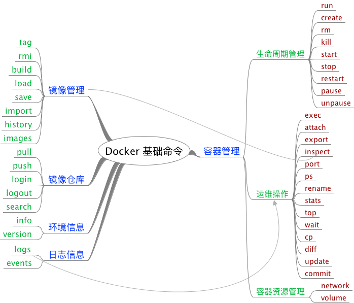

# Docker 基础命令



## Docker run reference

```
# docker run --help

Usage:  docker run [OPTIONS] IMAGE [COMMAND] [ARG...]

Run a command in a new container
```

### Detached vs foreground

容器的运行方式有前台和后台（detached）两种模式，默认为前台运行。

#### Detached (-d)

| 选项 | 说明 |
| :--  | :--  |
| -d, --detach | 后台运行容器，并输出容器 id |

使用 `-d` 选项或者 `-d=true` 使得容器后台运行：

```
# docker run -d busybox sleep 20
a69a80e9e16298255612c6ba73efc94b3d43d40d7ae30e4832c5e4b41de24356
# docker attach a69a80
```

使用 `docker attach` 命令重新连接后台容器。`attach` 可以理解为在当前终端，连接到后台运行的容器，等同前台操作运行容器。

#### Foreground

| 选项 | 说明 |
| :--  | :--  |
| -a, --attach list | Attach to STDIN, STDOUT or STDERR (default []) |
| -t, --tty | 分配一个伪终端 |
| --sig-proxy | 转发所有的信号给进程 (默认为 true，仅在 non-tty 模式下生效) |
| -i, --interactive | 保持 STDIN 打开即使在后台运行 |

```
# docker run --rm -it busybox sh
/ # echo "This is a test"
This is a test
```

* `--rm`: 选项表示容器停止后，自动清理容器，方便调试情况下使用，不能和 `-d` 选项同时执行
* `-it`: `-i`、`-t` 选项一般同时执行，用于和容器交互操作，比较常用

## 运行时资源限制


## 运行时权限和 Linux 功能


## 日志驱动

## 覆盖 Dockerfile 镜像默认值

### CMD (默认命令或选项)

### ENTRYPOINT (默认执行命令)

### EXPOSE (暴露端口)

### ENV (环境变量)

### HEALTHCHECK

### VOLUME

### WORKDIR
